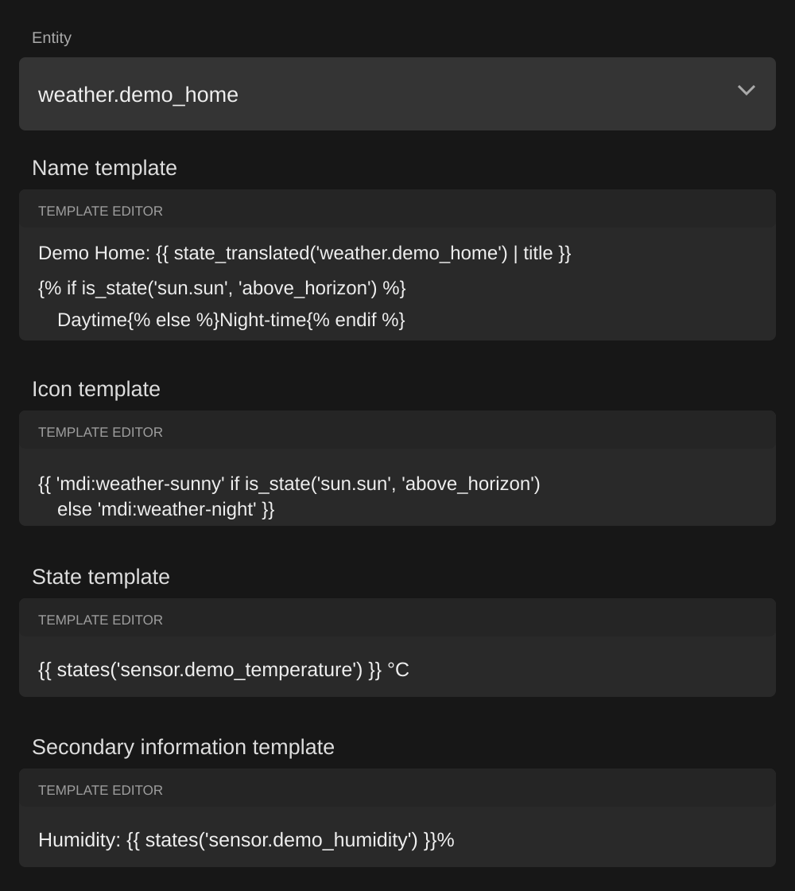
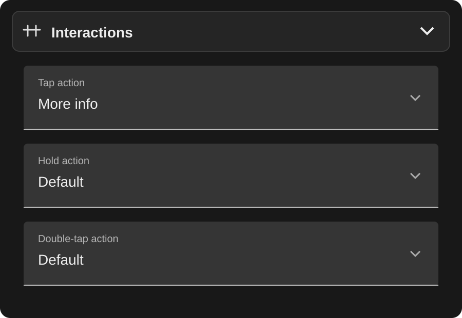
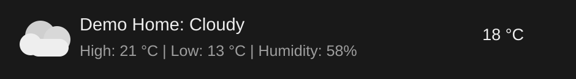
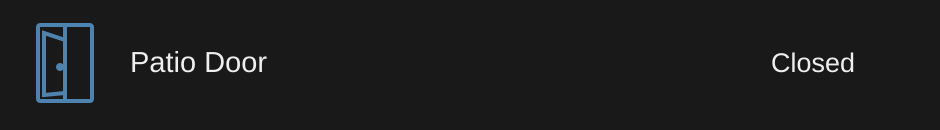

# Template Entity Row

[](https://github.com/oneseventhree/template-entity-row/actions/workflows/build.yml)
[](https://www.hacs.xyz/docs/faq/custom_repositories/)
[](https://github.com/oneseventhree/template-entity-row/releases/latest)

The actively maintained and updated fork of Template Entity Row for current
Home Assistant releases. It adds a complete visual editor, reliable template
rendering, native Home Assistant icons and modern compatibility while keeping
existing `custom:template-entity-row` YAML working.

This project is based on
[Thomas Lovén's original `lovelace-template-entity-row`](https://github.com/thomasloven/lovelace-template-entity-row)
and remains available under the original MIT licence. This fork is independently
maintained and is not maintained by the original author.

## What changed in v1.0.0

| Area | Updated fork |
| --- | --- |
| Editing | Full visual editor inside the Home Assistant Entities card editor |
| Templates | Multiline template inputs for all display fields without briefly showing raw Jinja while loading |
| Icons | Reliable dynamic custom icons, including `phu:`, plus native state-aware Home Assistant icons by default |
| Weather | Home Assistant's layered native weather artwork rather than a monochrome fallback icon |
| Performance | Template subscriptions start concurrently and are safely replaced or removed when configuration changes |
| Layout | Less-used controls live in a collapsed **More options** panel, with actions in a nested **Interactions** panel |
| Actions | Home Assistant action selectors for tap, hold and double-tap actions, with template support retained |
| Maintenance | Modernised TypeScript and Rollup build, automated builds, HACS validation and no known production dependency vulnerabilities |

## Screenshots

Every location, entity ID, template and value in these images is fictional and
is included only to demonstrate the editor.

### Template fields

The editor uses multiline Home Assistant template inputs for readable Jinja
configuration.



### Compact interactions

Tap, hold and double-tap actions remain collapsed inside **More options** until
they are needed.



### Native Home Assistant weather artwork

Weather entities can use the same layered artwork as Home Assistant's standard
weather row.



### Dynamic custom icons

Templated custom icon sets such as `phu:` update with the entity state.



## Installation

### HACS

Until this maintained fork is included in the default HACS repositories:

1. Open HACS in Home Assistant.
2. Open the HACS menu and select **Custom repositories**.
3. Add `https://github.com/oneseventhree/template-entity-row`.
4. Select **Dashboard** as the repository type.
5. Download the latest stable release.
6. Reload the browser after HACS finishes installing it.

### Replacing the original project

The maintained fork is a drop-in replacement and deliberately keeps the same
JavaScript filename and YAML type.

1. Back up your dashboard configuration.
2. Remove the original Template Entity Row installation from HACS.
3. Add and install this repository using the HACS steps above.
4. Confirm that only one `template-entity-row.js` resource is loaded.
5. Reload the browser.

Your existing rows remain:

```yaml
type: custom:template-entity-row
```

Do not load this fork and the original project at the same time. Both register
the same custom element.

### Manual installation

Download `template-entity-row.js` from the latest release, place it in your
Home Assistant `www` directory and add it as a JavaScript module resource:

```yaml
resources:
  - url: /local/template-entity-row.js
    type: module
```

## Usage

Template Entity Row is an entity row, not a standalone card. Place it inside an
Entities card.

### Basic row

```yaml
type: entities
entities:
  - type: custom:template-entity-row
    entity: sensor.outside_temperature
    name: Outside temperature
    state: "{{ states(config.entity) }} °C"
```

### Dynamic custom icon

```yaml
type: entities
entities:
  - type: custom:template-entity-row
    entity: binary_sensor.demo_patio_door
    name: Patio Door
    state: >-
      {{ 'Open' if is_state(config.entity, 'on') else 'Closed' }}
    icon: >-
      {{ 'phu:sliding-window-door-open' if is_state(config.entity, 'on') else 'phu:sliding-window-door-close' }}
```

### Native weather icon

Home Assistant's standard native icon is automatic whenever neither `icon` nor
`image` is configured. Weather entities additionally provide a **Weather icon
style** choice between layered artwork and the standard icon.

```yaml
type: custom:template-entity-row
entity: weather.home
name: "Home: {{ state_translated(config.entity) | title }}"
state: "{{ state_attr(config.entity, 'temperature') }} °C"
native_icon: true
```

Setting a custom `icon` or `image` takes precedence over the native icon.

### Conditional visibility

The row is visible when `condition` renders `true` and hidden when it renders
`false`. An omitted or empty condition always shows the row.

```yaml
type: custom:template-entity-row
entity: binary_sensor.front_door
name: Front door is open
condition: "{{ is_state(config.entity, 'on') }}"
```

### Entity toggle

Set `toggle: true` to replace the displayed state with Home Assistant's entity
toggle.

```yaml
type: custom:template-entity-row
entity: light.bed_light
name: Bed light
toggle: true
```

### Actions

Standard Home Assistant actions work for tap, hold and double tap.

```yaml
type: custom:template-entity-row
entity: light.bed_light
tap_action:
  action: toggle
hold_action:
  action: more-info
double_tap_action:
  action: navigate
  navigation_path: /lovelace/lights
```

An action may also be a template that renders a valid action configuration:

```yaml
type: custom:template-entity-row
entity: input_boolean.test
tap_action: >-
  {'action': '{{ "toggle" if is_state(config.entity, "on") else "more-info" }}'}
```

## Visual editor

Open an Entities card in Home Assistant's visual editor, then edit an existing
`custom:template-entity-row` row. Existing YAML configurations can be opened,
edited and saved without rewriting them.

The main editor contains:

- Entity
- Name template
- Icon template
- Icon colour template
- State template
- Secondary information template

The collapsed **More options** panel contains, in this order:

1. Show entity toggle
2. Weather icon style, shown only for eligible `weather.*` entities
3. Icon appearance
4. Visibility condition template
5. Image template
6. A separately collapsible **Interactions** panel

The Interactions panel contains tap, hold and double-tap action selectors. The
editor preserves configuration properties it does not recognise, so switching
between visual and YAML editing does not discard advanced settings.

## Configuration options

| Option | Type | Default | Description |
| --- | --- | --- | --- |
| `entity` | Entity ID or template | None | Entity used for default values and actions |
| `name` | Text or template | Entity name | Primary row text |
| `icon` | Icon or template | None | Custom icon; overrides the native icon |
| `state` | Text or template | Entity state | State text shown on the right |
| `secondary` | Text or template | None | Secondary text below the name |
| `color` | Colour or template | Entity state colour | Custom icon colour |
| `toggle` | Boolean or template | `false` | Replaces the state text with an entity toggle when true |
| `native_icon` | Boolean or template | `true` | Uses layered artwork for weather entities when true and the standard icon when false; retained for YAML compatibility |
| `active` | Boolean or template | Automatic | Controls whether the icon uses its active appearance |
| `condition` | Boolean or template | Visible | Shows the row when true and hides it when false |
| `image` | URL or template | None | Entity picture; overrides the native icon |
| `tap_action` | Action or template | More info | Action performed on tap |
| `hold_action` | Action or template | Default | Action performed on hold |
| `double_tap_action` | Action or template | Default | Action performed on double tap |

All display options accept Home Assistant Jinja templates. Templates receive:

- `config`: the original row configuration
- `user`: the current user's name
- `browser`: the browser-mod browser ID when available
- `hash`: the current URL hash

## Icon behavior

The visual editor's **Icon appearance** field has three modes:

- **Automatic** uses the entity's state to decide whether its icon is active.
- **Active** forces the active icon appearance.
- **Inactive** forces the inactive icon appearance.

For native weather artwork, leave `icon` and `image` empty and select **Layered
artwork**. Select **Standard icon** for the normal Home Assistant weather glyph.
For dynamic custom icons, configure `icon` with a template instead.

## Development

```bash
npm install
npm run check
npm run build
```

The production bundle is written to `template-entity-row.js`. Pull requests
must pass the automated build and HACS validation checks.
